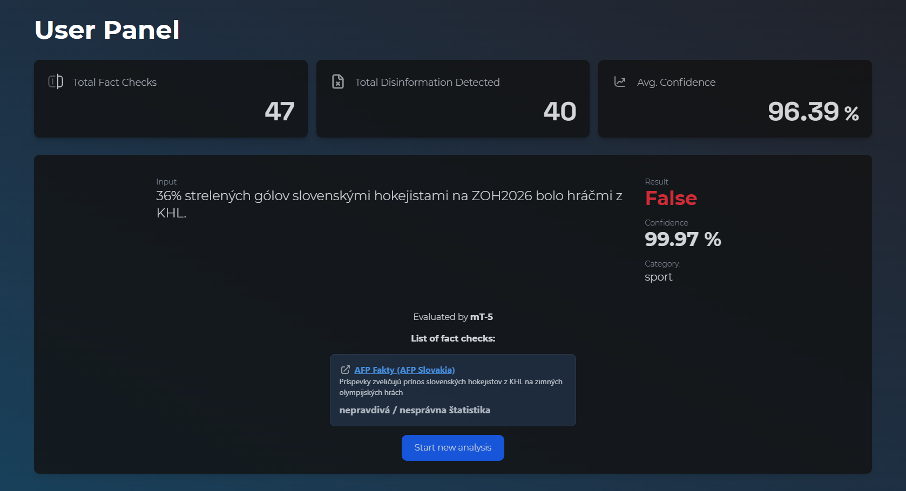

# SloFactCheck

SloFactCheck is a web application for multilingual detection using deep learning NLP models.



## Overview

The application is built as **React.js** frontend and a **Flask** backend. Users sign in with Google account, choose on of several models, submit text for prediction and receive prediction with result (label), topic and related fact-check links.

This project is intended as an educational and research-oriented tool. Outputs should always be verified against credible sources.

## Features

- Multilingual text analysis for disinformation detection
- Multiple model choices: `mBERT`, `XLM-RoBERTa`, `mT-5` and `mDeBERTa-v3`
- Google authentication with protected user routes
- Analysis history stored in Firebase Firestore
- Dashboard statistics and chart-based visualizations
- Topic classification into `politics`, `health`, `sport`, `culture`, or `others`
- Fact-check result lookup using Google Fact Check Tools API with OpenAI-based fallback
- English and Slovak UI localization
- Daily per-user analysis limit

## Tech Stack

- Frontend: React, Vite, TailwindCSS, Framer Motion, MUI Charts, i18next
- Backend: Flask, Gunicorn, Firebase Admin SDK, OpenAI SDK
- Services: Firebase Authentication, Firestore, Gradio, Google Fact Check Tools API

## Project Structure
```
├── README.md
├── client
│   ├── components.json
│   ├── eslint.config.js
│   ├── index.html
│   ├── jsconfig.json
│   ├── package-lock.json
│   ├── package.json
│   ├── public
│   ├── src
│   │   ├── App.jsx
│   │   ├── assets
│   │   ├── components
│   │   ├── context
│   │   ├── hooks
│   │   ├── i18n
│   │   ├── index.css
│   │   ├── lib
│   │   ├── main.jsx
│   │   └── pages
│   └── vite.config.js
└── server
    ├── app_core
    │   ├── __init__.py
    │   ├── app_factory.py
    │   ├── clients.py
    │   ├── config.py
    │   ├── observability.py
    │   ├── routes
    │   └── services
    ├── gunicorn.conf.py
    ├── requirements.txt
    └── server.py
```

## Getting Started

### Prerequisities

- Python 3.12+
- Firebase project and service account credentials
- Optional: OpenAI API key
- Optional: Google Fact Check Tools API key

### Backend Setup

```
cd server
python -m venv .venv
source .venv/bin/activate
pip install -r requirements.txt
```

#### Create server/.env:

```
GRADIO_API_URL=hai2001jpg/slofactcheck
FACTCHECK_API_KEY=...
OPENAI_API_KEY=...
```
#### Start the backend:

Test Environment
```
python server.py
```
or

Production
```
gunicorn server:app
```
### Frontend setup
```
cd client
npm install
```
#### Create client/.env:

```text
VITE_BASE_URL=http://localhost:8000
```

#### Start the frontend:

Test Environment
```
npm run dev
``` 
or

Production
```
npm run build
npm run preview
```
## API Overview

- POST /analysis: analyze text, classify topic and store result
- GET /analysis?userId/... : fetch analysis history and remaining daily quota
- POST /topic: classify text into of the supported categories
- GET /factcheck?query=... : retrieve related fact-checks

## User Flow

1. Sign in with Google
2. Open the **UserPanel**
3. Select a model and submit text
4. Review predicted result along with confidence score, topic and fact-check links
5. Revisit previous analyses in **History**
6. Explore usage trends in **Statistics**

## Disclaimer

SloFactCheck is an assistive tool, you should always verify claims through multiple reliable sources before making decisions based on the output.